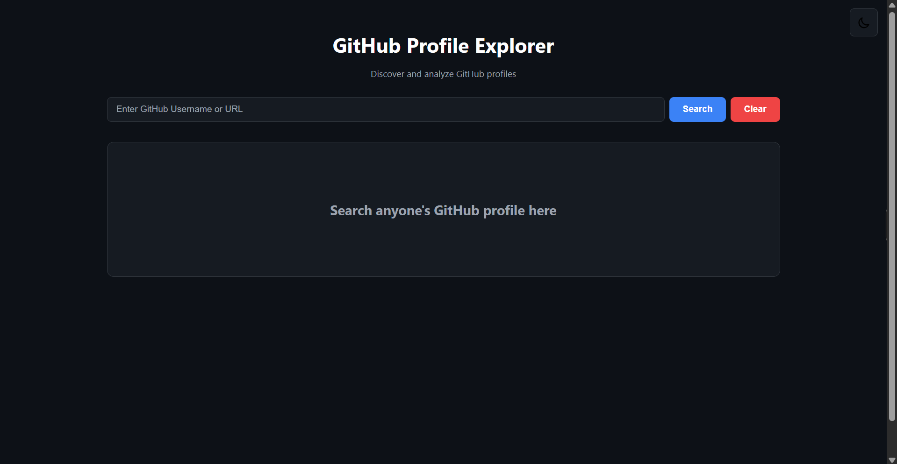
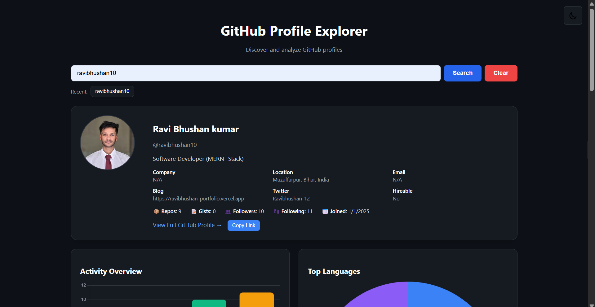
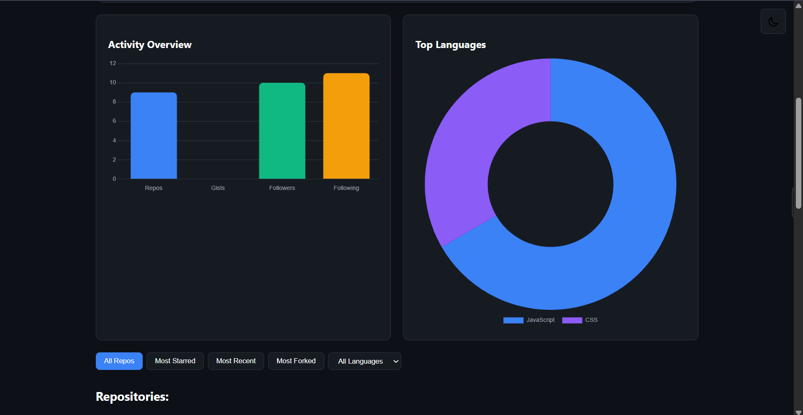
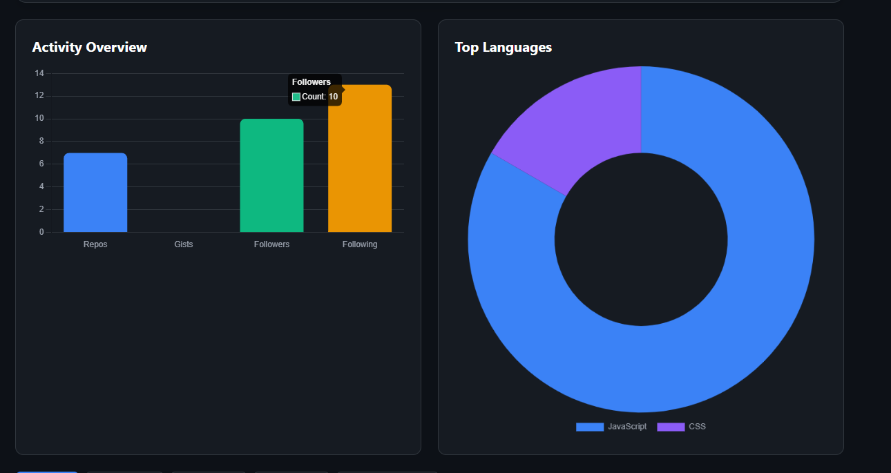
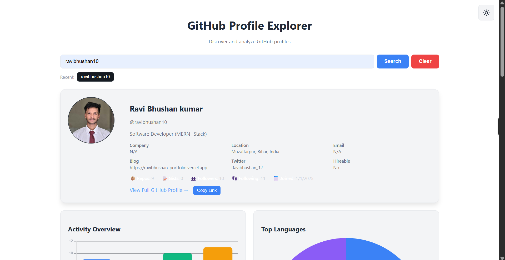

# 🚀 GitHub Profile Explorer
A beautiful, feature-rich web application to explore and analyze GitHub profiles with interactive visualizations and real-time data.


## 📸 Screenshots







## [Live Demo](https://github-profile-view-pi.vercel.app)


##  🌟Features

###  🫰**Theme Support**
- **Dark Mode** (Default) - Easy on the eyes with GitHub-inspired dark theme
- **Light Mode** - Clean and bright interface for daytime use
- Smooth theme transitions with persistent selection

### 🔍 **Smart Search**
- Search by GitHub username or profile URL
- Search history tracking (last 5 searches)
- Quick access buttons for recent searches
- Enter key support for faster searching
- URL parsing (supports github.com/username format)

### 📊 **Interactive Visualizations**
- **Activity Overview Chart** - Bar chart showing repos, gists, followers, and following
- **Top Languages Chart** - Doughnut chart displaying the top 5 programming languages used
- Powered by Chart.js for smooth, responsive charts

### 🗂️ **Advanced Repository Filtering**
- **All Repos** - Default chronological view
- **Most Starred** - Sort by popularity
- **Most Recent** - Latest repositories first
- **Most Forked** - Most forked projects
- **Language Filter** - Dropdown to filter by programming language

### 💼 **Comprehensive Profile Display**
- Avatar and basic info (name, username, bio)
- Detailed stats (repos, gists, followers, following, join date)
- Company, location, email, blog, and Twitter info
- Hireable status indicator
- Direct link to GitHub profile
- Copy profile link button

### 🎯 **Repository Cards**
Each repository displays:
- Repository name with icon
- Description
- Primary language
- Star count
- Fork count
- Creation date
- Direct link to repository

## 🛠️ Technologies Used
- **HTML5** - Semantic structure
- **CSS3** - Custom styling with animations
- **JavaScript (ES6+)** - Core functionality
- **GitHub REST API** - Data fetching
- **LocalStorage API** - Search history persistence


## 🚀 Getting Started

### Installation

1. **Clone the repository**
   ```bash
   git clone https://github.com/ravibhushan10/github-profile-view
   ```

2. **Navigate to project directory**
   ```bash
   cd github-profile-view
   ```

3. **Open in browser**
   ```bash
   open index.html in your browser


### Usage

1. **Search for a Profile**
   - Enter a GitHub username (e.g., `torvalds`) or full URL
   - Click "Search" or press Enter

2. **Explore the Profile**
   - View user information and statistics
   - Analyze activity charts
   - Browse repositories

3. **Filter Repositories**
   - Use filter buttons to sort repos
   - Select a language from the dropdown
   - Click any repo card to visit it on GitHub

4. **Toggle Theme**
   - Click the moon/sun icon in the top-right corner
   - Theme preference is saved automatically

5. **Clear Results**
   - Click "Clear" button to reset the view


## 📊 API Information

This project uses the **GitHub REST API v3**:
- **User Endpoint**: `https://api.github.com/users/{username}`
- **Repos Endpoint**: `https://api.github.com/users/{username}/repos`
- **Rate Limit**: 60 requests/hour (unauthenticated)
- **Documentation**: [GitHub API Docs](https://docs.github.com/en/rest)

## 🤝 Contributing

Contributions are welcome! Here's how you can help:
1. **Fork the repository**
2. **Create a feature branch**
   ```bash
   git checkout -b feature/AmazingFeature
   ```
3. **Commit your changes**
   ```bash
   git commit -m 'Add some AmazingFeature'
   ```
4. **Push to the branch**
   ```bash
   git push origin feature/AmazingFeature
   ```


## 👨‍💻 Author

**Ravi Bhushan**

- LinkedIn: [Your LinkedIn](https://www.linkedin.com/in/ravibhushan-kumar-55b312344/)
- Portfolio: [Your Portfolio](https://ravibhushan-portfolio.vercel.app)
- GitHub: [@ravibhushan10](https://github.com/ravibhushan10)
- Email: ravibhushankumar87tp@gmail.com

---

<div align="center">

### ⭐ Star this repository if it helped you!

**Made with ❤️ by Ravi Bhushan**

[Live Demo](https://github-profile-view-pi.vercel.app) · [Report Bug](https://github.com/ravibhushan10/github-profile-view/issues) · [Request Feature](https://github.com/ravibhushan10/github-profile-view/issues)

---

